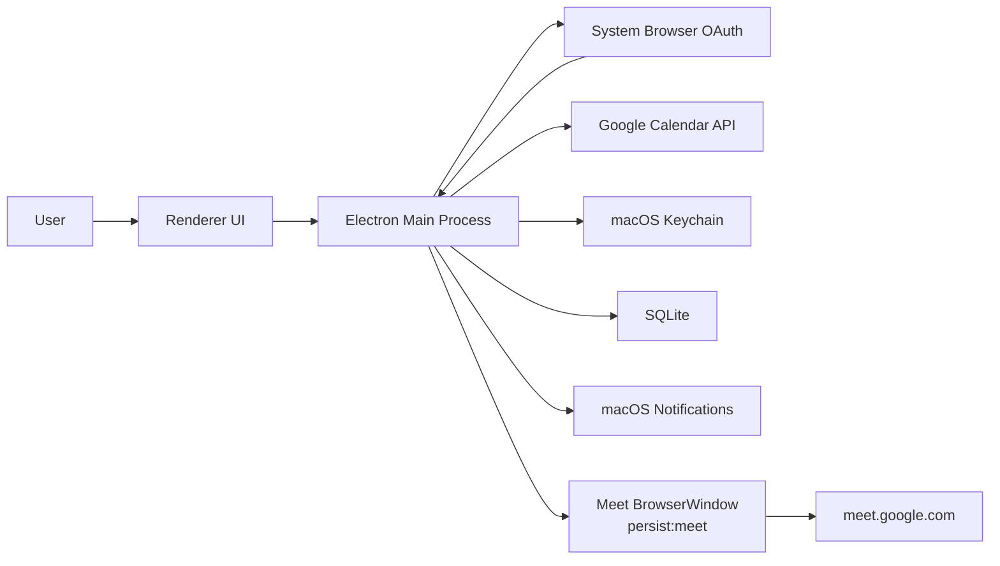
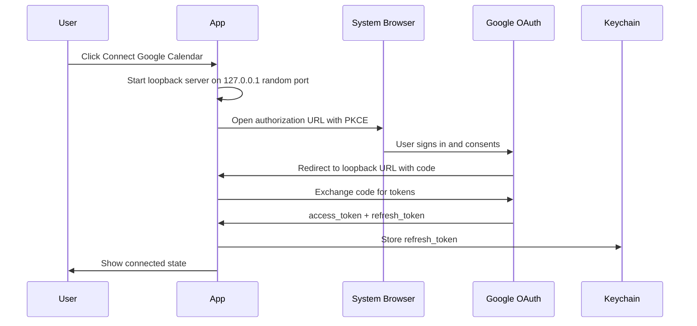

# Detailed Design

## 1. System Overview

The app is a local-first macOS Electron application that:

1. Authenticates with Google Calendar using OAuth in the system browser.
2. Polls Google Calendar for upcoming events.
3. Extracts Google Meet links from event conference data.
4. Schedules notifications and optional auto-open actions.
5. Opens Meet URLs inside a dedicated Electron BrowserWindow with persistent session storage.



## 2. Process Model

### Main Process Responsibilities

- App lifecycle
- OAuth loopback server
- Token refresh
- Calendar polling
- Meet event normalization
- Timer scheduling
- Notification display
- Meet BrowserWindow lifecycle
- SQLite persistence
- Keychain access
- IPC API boundary

### Renderer Responsibilities

- Account connection screen
- Upcoming Meet list
- Settings screen
- Permission/status indicators
- Manual join button

Renderer does not access tokens, SQLite, Node APIs, or Google APIs directly.

### Meet Window Responsibilities

- Render Google Meet Web.
- Maintain separate Google web session.
- Request media permissions through Electron/macOS.
- Avoid app-specific preload unless required.

## 3. Module Design

```text
src/
  main/
    adapters/
      keychainTokenStore.ts
    app.ts
    oauth/
      oauthClient.ts
      loopbackServer.ts
      tokenStore.ts
    calendar/
      calendarClient.ts
      calendarSyncService.ts
      meetExtractor.ts
    scheduler/
      meetingScheduler.ts
      launchDeduper.ts
    meet/
      meetWindowManager.ts
      navigationPolicy.ts
      permissionManager.ts
    notifications/
      notificationManager.ts
    persistence/
      database.ts
      settingsRepository.ts
      eventCacheRepository.ts
    ipc/
      ipcHandlers.ts
  renderer/
    App.tsx
    screens/
      Dashboard.tsx
      Settings.tsx
      Account.tsx
    components/
      UpcomingMeetList.tsx
      PermissionStatus.tsx
  shared/
    errors.ts
    ipc.ts
    types.ts
    validators.ts
tests/
  calendar/
  scheduler/
  adapters/
  renderer/
scripts/
  assert-arrow-functions.mjs
```

## 4. Data Model

### Settings

```ts
type AppSettings = {
  autoOpenEnabled: boolean;
  notifyBeforeMinutes: number;
  openOffsetSeconds: number;
  launchAtLogin: boolean;
  calendarId: "primary";
  timezone: string;
};
```

### Normalized Meet Event

```ts
type MeetEvent = {
  eventId: string;
  recurringEventId?: string;
  occurrenceKey: string;
  calendarId: string;
  summary: string;
  startAt: string;
  endAt: string;
  updatedAt: string;
  meetUrl: string;
  meetCode?: string;
  organizerEmailHash?: string;
  responseStatus?: "accepted" | "tentative" | "declined" | "needsAction";
  status: "confirmed" | "cancelled";
};
```

`occurrenceKey` is:

```text
{calendarId}:{eventId}:{startAt}
```

This prevents duplicated launches for recurring event instances.

### Launch Record

```ts
type LaunchRecord = {
  occurrenceKey: string;
  meetUrlHash: string;
  launchedAt: string;
  eventUpdatedAt: string;
};
```

If `eventUpdatedAt` changes materially, the scheduler may re-evaluate the event, but it must not relaunch if the same meeting is already open.

## 5. SQLite Tables

```sql
CREATE TABLE settings (
  key TEXT PRIMARY KEY,
  value TEXT NOT NULL
);

CREATE TABLE event_cache (
  occurrence_key TEXT PRIMARY KEY,
  calendar_id TEXT NOT NULL,
  event_id TEXT NOT NULL,
  summary TEXT NOT NULL,
  start_at TEXT NOT NULL,
  end_at TEXT NOT NULL,
  updated_at TEXT NOT NULL,
  meet_url TEXT NOT NULL,
  status TEXT NOT NULL,
  raw_redacted_json TEXT,
  cached_at TEXT NOT NULL
);

CREATE TABLE launch_records (
  occurrence_key TEXT PRIMARY KEY,
  meet_url_hash TEXT NOT NULL,
  launched_at TEXT NOT NULL,
  event_updated_at TEXT NOT NULL
);
```

Do not persist attendees or full descriptions in MVP.

## 6. OAuth Flow



Required scopes:

- `https://www.googleapis.com/auth/calendar.events.readonly`

Optional later:

- `https://www.googleapis.com/auth/calendar.readonly` if calendar list selection is added.

Do not request broader write scopes in MVP.

## 7. Calendar Sync Flow

1. Load refresh token from Keychain.
2. Refresh access token if missing or expired.
3. Call `events.list` for `primary`.
4. Use:
   - `timeMin=now - 5 minutes`
   - `timeMax=now + 24 hours`
   - `singleEvents=true`
   - `orderBy=startTime`
   - `maxResults=50`
5. Normalize events.
6. Extract Meet URLs.
7. Store redacted event cache.
8. Diff against scheduled timers.
9. Schedule notifications and launches.

Sync cadence:

| State | Interval |
| --- | --- |
| Normal | 60 seconds |
| Event starts within 10 minutes | 15 seconds |
| API error | 30s, 60s, 120s, max 5m |
| App resume/wake | Immediate sync |

## 8. Meet Extraction Algorithm

```ts
function extractMeetUrl(event: CalendarEvent): string | null {
  const videoEntry = event.conferenceData?.entryPoints?.find(
    (entry) => entry.entryPointType === "video" && isMeetUrl(entry.uri)
  );
  if (videoEntry?.uri) return canonicalizeMeetUrl(videoEntry.uri);

  if (isMeetUrl(event.hangoutLink)) {
    return canonicalizeMeetUrl(event.hangoutLink);
  }

  const textCandidates = [event.location, event.description].filter(Boolean);
  for (const text of textCandidates) {
    const url = findFirstMeetUrl(text);
    if (url) return canonicalizeMeetUrl(url);
  }

  return null;
}
```

Canonicalization:

- Keep `https://meet.google.com/{code}`.
- Preserve safe query parameters only if needed by Meet.
- Strip tracking fragments.
- Normalize trailing slash.

## 9. Scheduler Design

The scheduler maintains two timers per event:

- notification timer
- auto-open timer

Rules:

- Ignore cancelled events.
- Ignore all-day events.
- Ignore events whose end time is already past.
- Ignore events where self attendee response is `declined`, unless setting `openDeclinedEvents=true` is added later.
- If notification time is already past but event starts within 5 minutes, show an immediate "starting now" notification.
- If auto-open time is already past but event is currently active, open immediately on app startup only if `autoOpenMissedActiveMeeting=true` is enabled. Default false.

## 10. Meet Window Manager

### Window Creation

```ts
const win = new BrowserWindow({
  width: 1280,
  height: 860,
  show: false,
  title: "Google Meet",
  webPreferences: {
    partition: "persist:meet",
    sandbox: true,
    contextIsolation: true,
    nodeIntegration: false
  }
});
```

### Open Behavior

1. Check existing window by canonical Meet URL.
2. If found, focus it.
3. If not found, create a new Meet window.
4. Apply navigation policy.
5. Load Meet URL.
6. Show on `ready-to-show` or after a timeout.

### Session Behavior

- `persist:meet` keeps cookies and cache across app restarts.
- Calendar OAuth token storage is independent from Meet cookies.
- "Reset Meet session" setting clears the Electron session storage for `persist:meet`.

## 11. Navigation Policy

The Meet window must apply:

- `will-navigate`
- `setWindowOpenHandler`
- `will-redirect`

Policy:

| Target | Action |
| --- | --- |
| `https://meet.google.com/*` | Allow |
| `https://accounts.google.com/*` | Allow |
| Required Google auth/static origins | Allow |
| `https://calendar.google.com/*` | Open external browser |
| `mailto:`, `tel:` | Open external handler |
| `file:`, unknown protocol, `http:` | Block |
| Other `https:` | Open external browser |

## 12. Permission Design

### Camera and Microphone

- Include usage descriptions in packaged app metadata.
- Use `systemPreferences.getMediaAccessStatus("camera")` and `"microphone"` for preflight.
- Allow Meet origin to request camera/microphone.
- Surface permission problems in the app dashboard.

### Screen Sharing

- Use Electron display media handling where required.
- Add screen capture usage description for macOS packaging.
- Provide fallback instruction when macOS Screen Recording permission is missing.

## 13. IPC Contract

Renderer can call only these main-process commands:

```ts
type IpcCommand =
  | "account:getStatus"
  | "account:connect"
  | "account:disconnect"
  | "calendar:syncNow"
  | "meet:listUpcoming"
  | "meet:open"
  | "settings:get"
  | "settings:update"
  | "permissions:getStatus";
```

All IPC payloads are validated with `zod`.

Renderer never receives:

- refresh token
- access token
- raw event description
- full attendee list

## 14. Error Handling

| Error | User-visible state | Recovery |
| --- | --- | --- |
| OAuth denied | Not connected | Retry connect |
| Refresh token revoked | Reconnect required | Delete token, show connect |
| Calendar API 401 | Reconnect required | Clear token after refresh fails |
| Calendar API 403 | Access denied | Show scope/project issue |
| Network offline | Offline | Use cached events, retry |
| Meet session signed out | Meet login required | Open Meet login window |
| Camera denied | Permission required | Show macOS settings guidance |
| Duplicate event timer | Hidden internal state | Deduplicate by occurrenceKey |

Implementation rules:

- Use `neverthrow` for expected failures.
- Domain services return `Result<T, AppError>`.
- Async adapters return `ResultAsync<T, AppError>`.
- Third-party Promise rejection is wrapped with `ResultAsync.fromPromise`.
- IPC converts results to `{ ok: true, value } | { ok: false, error }`.
- `throw` is reserved for programmer errors and unrecoverable boot invariants.

## 15. Security Controls

- OAuth in system browser only.
- PKCE for authorization code flow.
- Keychain for refresh token.
- No token exposure to renderer.
- No Node integration in renderers.
- `contextIsolation=true`.
- `sandbox=true`.
- CSP for app renderer.
- Strict navigation allowlist for Meet window.
- Redacted logging.
- Dependency update policy for Electron.

## 16. Packaging and Distribution

Development:

- Unsigned local app can run basic flow.
- Camera/microphone permission behavior must be tested on a packaged app.

Production:

- Apple Developer ID signing.
- Notarization.
- Hardened runtime.
- Entitlements for camera, microphone, screen capture as needed.
- Public OAuth consent screen metadata, privacy policy, and support URL.

## 17. MVP Implementation Plan

### Milestone 1: Skeleton

- Electron + Vite + React + TypeScript setup
- Main/renderer IPC bridge
- Settings persistence
- Dashboard shell

### Milestone 2: Google Calendar Connection

- OAuth loopback flow
- Keychain token storage
- Calendar API client
- Manual sync button

### Milestone 3: Meet Detection and Scheduling

- Event normalization
- Meet URL extraction
- Upcoming list
- Notification timer
- Auto-open timer
- Duplicate launch prevention

### Milestone 4: Meet Browser

- Dedicated Meet BrowserWindow
- Persistent session
- Navigation policy
- Manual join and automatic launch

### Milestone 5: macOS Readiness

- Camera/microphone permission preflight
- Login item setting
- Packaged app smoke test
- Basic notarization path

## 18. Open Questions

1. 初期版で Dock アプリにするか、メニューバー常駐アプリにするか。
2. 複数カレンダー対応を MVP に含めるか。
3. 自動起動をデフォルト ON にするか、通知からの手動参加を初期値にするか。
4. 会議終了後に Meet ウィンドウを自動で閉じるか。
5. Google OAuth consent screen を internal/test 用にするか、外部配布前提で verification まで進めるか。

## 19. Recommended MVP Defaults

- App type: Dock + menu bar icon
- Calendar: primary only
- Notification: 1 minute before
- Auto-open: off by default
- Manual join: always visible
- Meet session: persistent
- Polling: 60 seconds
- Lookahead: 24 hours
- OAuth scope: calendar events readonly only
